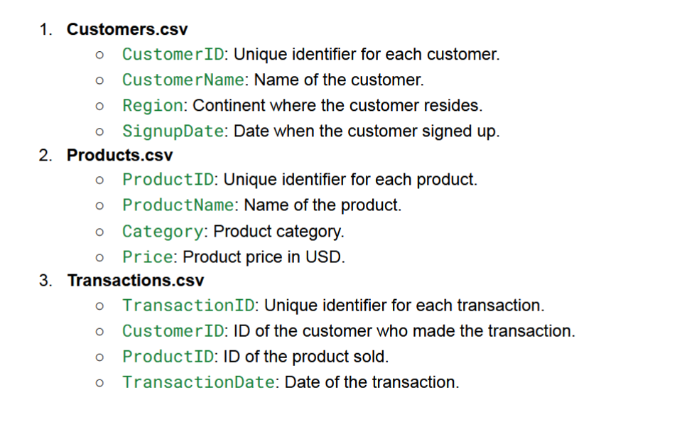

# **Data Science Assignment on eCommerce Transactions Dataset**

We have with an eCommerce Transactions dataset consisting of three files
Customers.csv, Products.csv, and Transactions.csv. The task is to perform
exploratory data analysis (EDA), build predictive models, and derive actionable insights from this dataset.

## **Information about Files**

## **Tasks:**

### 1. **Exploratory Data Analysis and Business Insights**

### 2. **Build a Lookalike Model**

### 3. **Perform Customer Segmentation using Clustering** 